# Introduction

Healthy lifestyle choices, such as balanced eating and regular exercise,
are consistently linked to improve physical and mental health, lower
risk of chronic disease, and increased life
expectancy [@Li2018; @Stachera2025]. However, making these choices is
practically challenging, because busy schedules leave little time or
attention for tracking food, activity, and nutrition daily. Digital
health tools have lowered this barrier by letting people collect health
data continuously and receive personalized feedback, which has made
self-monitoring more accessible [@Amiri2023; @nam2024; @Xu2018]. Not
only that, supporting healthy living at all ages is now a public
priority, reflected in the United Nations Sustainable Development Goal 3
on health and well-being [@UN2015].

Nevertheless, these tools usually focus on a specific health domain in
isolation. Meanwhile, health has been shown to be improved most when
multiple domains are addressed simultaneously, for example diet
alongside physical activity [@Daubenmier2007], yet most platforms
specialize in a single domain and rarely combine them
well [@ref8; @Amiri2023]. As a result, users are switching back and
forth between separated apps to plan meals, log workouts, and check
nutrition, which raises cognitive load and breaks the continuity of
their experience [@Olakotan2025]. This burden will contribute to app
fatige, a cumulative sense of frustration that discourages sustained use
and cause users to abandon the tools that meant to support their health
goals [@Ali2025].

In the meantime, these challenges are particularly important in Vietnam,
where diet-related noncommunicable diseases continue to increase and
healthy eating has become an important public health
concern [@ref1; @WHO_NCDMort3070]. The most widely used meal and fitness
apps are built around Western food databases, portion conventions, and
dietary patterns, and are mostly available in English [@Anguyen2024].
Vietnamese cuisine is built on different staples, dishes, and eating
habits, so these apps represent local foods poorly and produce
inaccurate calorie and nutrient estimates unless users enter everything
by hand [@Li2024]. Their recommendations and educational content assume
patterns that do not match what most Vietnamese people actually eat and
exercise. Therefore, a Vietnamese user is left doing extra work for
guidance that is less accurate and less relevant to daily life.

This paper presents Viet MealFit, a web platform that addresses both of
those mentioned gaps. It brings personalized meal planning, exercise
planning, calorie and macronutrient calculation, nutrition information,
community support, an educational library, and an AI chatbot together in
one place, and it is designed specifically for Vietnamese users and
their food culture. The system uses a modular architecture, so the same
design can be extended to other cultural contexts by expanding its
underlying database. We describe the design, development, and evaluation
of Viet MealFit, centered on a comparative study of the full platform
against a basic version that contains only its core functionality.

The contributions of this paper are:

1.  **Viet MealFit**, a user-centered web platform that integrates seven
    modules for personalized analysis and planning of diet and fitness,
    tailored to Vietnamese users and extensible to other cultural
    contexts.

2.  A survey (N=57) assessing the needs and demand for a comprehensive,
    personalized health platform among Vietnamese users.

3.  A comparative usability study (N=21) evaluating how Vietnamese users
    experience the full and basic versions of Viet MealFit.

The remainder of the paper is organized as follows.
Section [2](#related){reference-type="ref" reference="related"} reviews
related work. Section [3](#design){reference-type="ref"
reference="design"} describes the design of Viet MealFit and its main
features. Section [4](#eva){reference-type="ref" reference="eva"}
reports the two studies and their results.
Section [5](#conclude){reference-type="ref" reference="conclude"}
concludes and outlines future work.

# Related Works {#related}

## Digital Tools for Diet and Physical Activity Self-Monitoring {#related:selfmonitoring}

Self-monitoring technologies have been regarded by European countries to
be the most cost effective and efficient way of providing heath
care [@EC2015]. It has empowered people to adjust their lifestyle, and
has been recognized by the public health as a potential population
health tool [@Pols2019]. Specifically, a systematic review of 12
randomised controlled trials found that digital self-monitoring of diet
and physical activity produced a significant weight reduction of 2.87 kg
relative to control conditions [@Berry2021], while a review of 39
studies reported that greater digital self-monitoring was associated
with weight loss in 74% of the observed instances [@Patel2021].

There are multiple fields of digital health and fitness, but few of them
manage to successfully integrate all-inclusive, personalized functions
that are truly fit in to specific culture. Many current platforms focus
on just one area, like meal planning [@ref7; @ref13] or tracking
exercise [@ref14; @ref15]. For example, some applications, such as
Cook-it! [@ref12] provide online meal planning with community aspects,
while others focus to create meal suggestions using certain methods
[@ref16]. Similarly, numerous apps offer workout libraries or assist
users in generating basic plans [@ref17; @ref18], sometimes using AI for
recommendations [@ref8; @ref19].

Research has also explored solutions to make nutritional information
more personal, by using sensors [@ref21] or studying user behavior
[@ref22], and with the help of AI chatbots [@ref20]. Virtual Reality
platforms are also coming up to make exercise more intriguing
[@ref23; @ref24]. On the other hand, there is still a crucial gap: Not
many platforms combine personalized meal planning (that considers local
dishes), flexible exercise procedures (with clear instructions),
detailed nutrition information, and support from a community or AI, to
make a single practical system. This is very relatable, especially for
countries outside the West, such as Vietnam.

Some platforms, like MEAL [@ref25], aim to teach about nutrition, and
others are developed for distinct groups of individuals or particular
types of data [@ref26; @ref27]. Even if these apps are good in some
ways, they often don't offer a complete set of features that is fit in
users' culture in specific regions. This points to the difficulties of
having tools that don't work together and a lack of detailed local
information. Viet MealFit sets itself apart by providing a holistic
solution to this very problem. It moves beyond single-functionality by
comprehensively compbine personalized planning (for both meals and
exercise), information on local dishes (e.g., Vietnamese foods), and
support tools (e.g., community, AI) into one integrated platform. This
approach is our key solution, as it directly confronts the widespread
issues of application fragmentation and the lack of cultural
personalization that undercover the effectiveness of so many existing
digital health solutions.

# Methodology {#design}

The web-based application Viet MealFit was created with an emphasis on
user-centric design and smooth interaction between all of its features.
Utilizing common web technologies, the development approach placed a
strong emphasis on user interaction. Client-side management of
user-generated content was primarily used for features like the forum
and e-library.

## System Architecture {#2a}

Addressing the issue of platform fragmentation identified as a key user
impediment, Viet MealFit combines several distinct modules accessible
through a unified interface. The core planning functionalities for
dietary intake (VietMeal) and exercise (VietFit) form the foundational
elements, as illustrated in Fig. [\[fig1\]](#fig1){reference-type="ref"
reference="fig1"} and Fig. [1](#fig2){reference-type="ref"
reference="fig2"}, respectively.

<figure id="fig2" data-latex-placement="htbp">

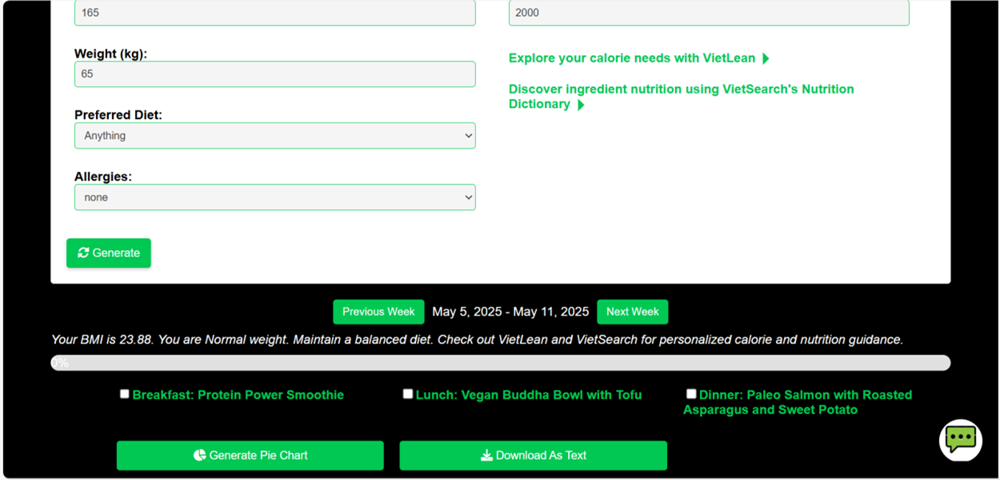

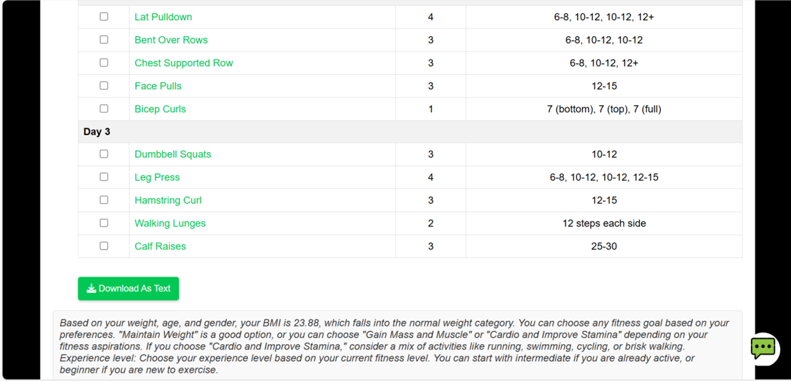

<figcaption>VietFit interface displaying the result after entering the
fields and clicking "Generate"</figcaption>
</figure>

These core modules are improved by tools for specific calculations
(VietLean), information retrieval (VietSearch), community engagement
(VietMeet), resource dissemination (VietSmart), and a personalized
virtual assistant (AI Chatbot). The system was designed to prioritize
modularity while ensuring that data input in one area (e.g., user
profile) can inform recommendations in others (e.g., generated plans),
fostering a linked user experience. The overall use case diagram is
presented in Fig. [2](#fig3){reference-type="ref" reference="fig3"}.

## Core Planning Model {#2b}

### VietMeal (Personalized Meal Planner)

VietMeal generates personalized daily and weekly meal plans based on
user inputs like body measurements, calorie goals (optional), dietary
choices (e.g., Anything, Keto, Vegan), and allergies. The system
suggests meals (breakfast, lunch, dinner). We initially considered an
external database but encountered major technical difficulties with
front-end compatibility, especially with efficiently displaying the
data. To ensure effective development, we implemented an alternative
solution: meal data, which is carefully gathered from credible online
nutritional references, was embedded as a JavaScript object array
directly within the front-end. This internal dataset includes recipes
with nutritional details, ingredients, and instructions, supporting
direct and adaptive data access. This internal data management approach
was also adopted for other data-intensive modules like VietFit,
VietLean, and VietSearch, due to similar initial technical challenges
with external database integration and to ensure consistent development.
The advanced version features macronutrient pie charts and options for
specific dietary targets (e.g., high-protein), with checkboxes for meal
tracking.

<figure id="fig3" data-latex-placement="h">
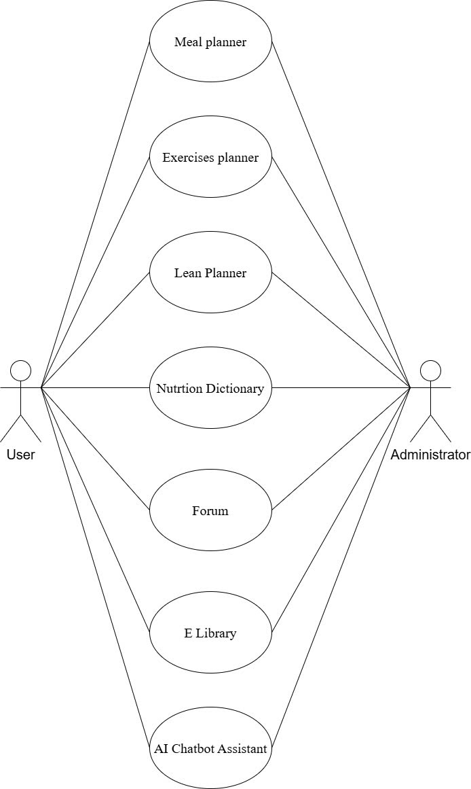
<figcaption>Overall Use Case Diagram</figcaption>
</figure>

### VietFit (Personalized Exercise Planner)

VietFit offers individualized fitness advice by evaluating and designing
unique training routines in recognition of the shortcomings of generic
exercise programs. User-provided information such as gender, age,
height, weight, experience level (beginner, intermediate, or advanced),
present physical limits, and fitness goals (e.g., muscle growth, weight
loss, or endurance improvement) form the basis of these plans. Users can
designate preferred activities for cardiovascular training objectives.
The underlying exercise data is managed using the same structure as
VietMeal. The daily schedule is arranged chronologically and includes
particular workouts, sets, and repetitions. In order to improve clarity
and user comprehension, choosing an exercise offers additional
information, such as targeted musculature, and in the more advanced
version, an integrated instructional video (e.g., YouTube). Interactive
checkboxes make it easier to track progress, and the user's Body Mass
Index (BMI) and input factors are used to generate tailored
recommendations.

<figure id="figvideoguidance" data-latex-placement="h">
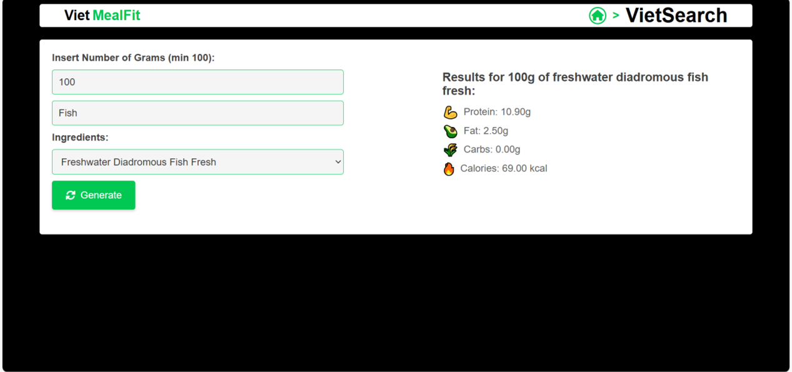
<figcaption>VietSearch interface displaying nutrient content of "100gram
of freshwater diadromous fish fresh"</figcaption>
</figure>

## Supporting Features

<figure id="fig6" data-latex-placement="htbp">

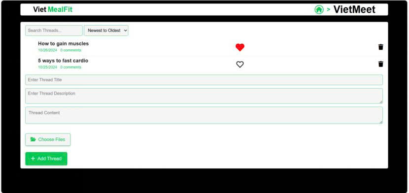

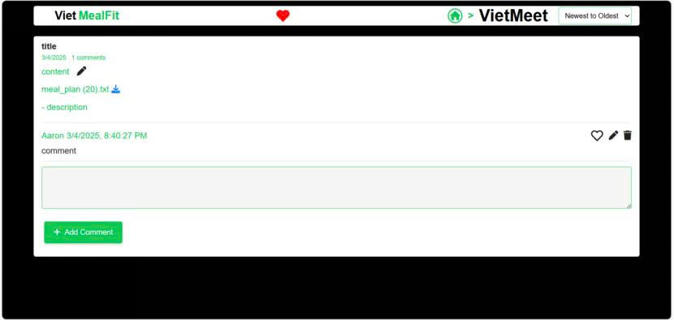

<figcaption>VietMeet interface displaying the title, description,
content, attached file, and comment in a thread</figcaption>
</figure>

Beyond the core planners, several supporting modules were developed and
integrated into Viet MealFit:

- **VietLean:** Based on user weight and selected fitness phase
  (Bulking, Lean, Cutting), VietLean estimates daily calorie and
  macronutrient targets to enable targeted nutritional management while
  also recommending suitable food categories. Data for calculations and
  recommendations in VietLean follows the same embedded JavaScript setup
  procedure used in VietMeal.

- **VietSearch:** Based on user-specified gram amounts, VietSearch
  provides a comprehensive nutrition dictionary that fills a known gap
  in localized nutritional data by allowing users to retrieve detailed
  nutritional information (calorie content, protein, carbohydrate, and
  fat composition) for a variety of food ingredients, as shown in
  Fig. [3](#figvideoguidance){reference-type="ref"
  reference="figvideoguidance"}, including regionally specific
  Vietnamese items. The nutritional data within VietSearch is also
  managed as an internal JavaScript object array, consistent with
  VietMeal.

- **VietMeet:** Offers a community forum where users can start threads,
  post comments (including text, emojis, and images), conduct searches,
  sort content, and interact with other users' posts by liking and
  deleting them, all within the context of fitness-related topics as
  shown in Fig. [\[fig5\]](#fig5){reference-type="ref" reference="fig5"}
  and Fig. [4](#fig6){reference-type="ref" reference="fig6"}, in order
  to foster peer support and knowledge exchange. User-generated content
  such as threads and comments in VietMeet is stored using browser
  localStorage.

- **VietSmart:** Including an E-Library, which enables users to upload,
  share, search, sort, preview, and download fitness-related resources
  like articles and guides, VietSmart serves as a central repository for
  user-contributed knowledge. Uploaded materials and their metadata in
  VietSmart are managed using localStorage.e.

- **AI Chatbot:** By responding to user questions about platform
  navigation or general fitness-related topics, the AI Chatbot offers
  easily accessible user assistance and interactive support. This
  functionality is powered by integration with the external AI Chatling
  service, customized with platform-specific data.

# Evaluation {#eva}

To assess the usability, effectiveness, and user perception of Viet
MealFit, we conducted a two-stage evaluation process. This structured
approach was designed to first establish the foundational user needs and
market gaps, and then to rigorously test our proposed solution.

**Stage 1 was a quantitative needs assessment** designed to validate the
core problem---that existing digital health tools are inadequate for the
Vietnamese context. Its purpose was to gather broad data on user habits,
frustrations, and expectations, thereby justifying the need for an
integrated, culturally-aware platform.

**Stage 2 was a comparative qualitative usability study.** Building
directly on the insights from the first stage, this stage aimed to
evaluate how effectively our implementation, Viet MealFit, addressed the
identified needs. By comparing a basic version against an advanced,
feature-rich version, we sought to measure the specific impact of our
design choices, such as personalization features, visual data aids, and
integrated support tools. Together, these two stages provide a
comprehensive evaluation, from problem validation to solution
assessment.

## Methodology {#methodology}

## Experiment 1: Quantitative Needs Assessment

#### **Purpose and Research Questions:**

The primary purpose of this initial experiment was to quantitatively
investigate the needs, behaviors, and expectations of potential
Vietnamese users regarding digital fitness and nutrition platforms. We
aimed to gauge the market demand and gather foundational data to guide
the development of Viet MealFit. Specifically, this study sought to
answer the following research questions:

- What is the current level of user satisfaction with existing digital
  health and fitness tools?

- How important do potential users consider the integration of fitness
  and nutrition planning into a single platform?

- Is there a significant perceived need for greater personalization,
  particularly concerning local Vietnamese cuisine and cultural context?

#### **Method:**

To address these questions, an initial online survey was distributed via
Google Forms to recruit 57 Vietnamese participants. The survey was
designed to measure satisfaction with existing tools and expectations
for an integrated platform. Questions covered familiarity, usage
frequency, the importance of integration and personalization, and
comfort with data sharing, using 5-point Likert scale ratings *(1 = not
familiar, not satisfied, or not useful; 5 = very familiar, very
satisfied, or very useful)* and open-ended questions. This stage allowed
us to validate our core premise and identify key user requirements
before prototype testing.

#### **Results (Needs Assessment):**

The initial survey (N=57) confirmed a strong market need. About 69% of
participants perceived integration of fitness and nutrition as
\"Important\" and \"Very Important\", while 76% of participants valued
personalization as \"Highly\" as displayed in
Fig. [\[figstudy1a\]](#figstudy1a){reference-type="ref"
reference="figstudy1a"}. Satisfaction with current apps was moderate,
with 39% of participants rated \"Satisfied\" and \"Very Satisfied\",
with weak support noted specifically for dietary planning, with 31% of
participants feeling \"Well\" and \"Very Well\" supported. 76% of
participants rated \"Likely\" and \"Very Likely\" to try a new
integrated platform as shown in
Fig. [5](#figstudy1b){reference-type="ref" reference="figstudy1b"}.
These findings validated the core motivation for Viet MealFit and
highlighted personalization and integration as key requirements.

<figure id="figstudy1b" data-latex-placement="htbp">

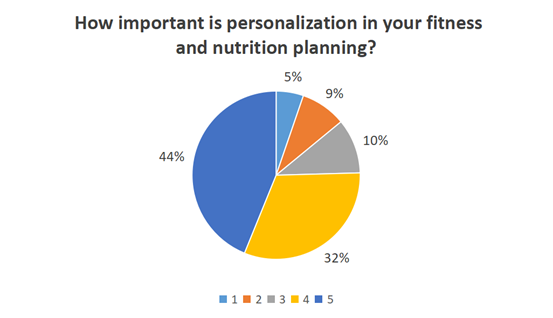

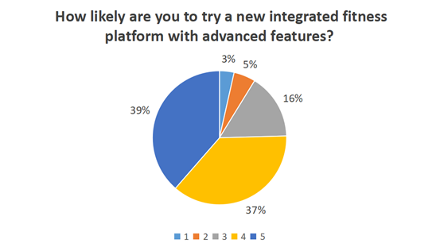

<figcaption>Obtained results showing how likely participants would like
to try out a new integrated fitness platform with advanced
features</figcaption>
</figure>

### Experiment 2: Comparative Qualitative Usability Study

#### **Purpose and Research Questions:**

Following the needs assessment, the second experiment was designed to
evaluate the usability and perceived value of the Viet MealFit platform.
The primary purpose was to compare a basic implementation (Version A)
against a feature-rich, integrated version (Version B) to understand the
impact of advanced functionalities. This study aimed to answer these key
questions:

- How useful and usable are the core planning functions (VietMeal,
  VietFit)?

- How do advanced features (e.g., nutrient pie charts, exercise videos,
  AI Chatbot) enhance the user experience compared to the basic version?

- Which version do users prefer, and what are the primary reasons for
  their preference?

- What are the main usability challenges and areas for improvement for
  the platform?

#### **Method:**

The evaluation involved a qualitative A/B testing approach with 21
participants (13 male, 8 female; mean age $21.6\pm1.166$; mixed fitness
levels and goals; recruited from university students). A within-subjects
design was used: each participant first interacted with a Basic Version
(A) of Viet MealFit (containing only the core VietMeal and VietFit
planners) and then with the Advanced Version (B) (containing all modules
and enhanced features like pie charts, video instructions, AI Chatbot,
etc.). Participants completed guided tasks on both versions, covering
core planning (meal/exercise) and advanced features (dictionary, forum,
AI, etc.). After interacting with each version, participants completed a
separate Google Forms questionnaire containing 5-point Likert scale
ratings (1 = *very poor, unclear, or not effective*, 5 = *excellent,
clear, or very effective*), clarity, satisfaction, likelihood of reuse,
and open-ended questions probing their experience, likes, dislikes,
challenges, and suggestions for that specific version. Qualitative data
were analyzed thematically, while quantitative ratings were aggregated
to identify trends.

#### **Results (Comparative Usability):**

The qualitative A/B testing (N=21) revealed a clear preference for the
Advanced Version (B) over the Basic Version (A).

Core Planners (Meal & Exercise):

- **Version A (Basic):** Users found the basic planners functional but
  noted limitations. Meal planning ease was rated moderately, with 76%
  of participants rating 'Easy' and 'Very Easy', while the rest stated
  'Neutral'. Exercise planning input was perceived as very easy by 76%
  of participants, but the lack of video guidance in this version was a
  noted drawback, even if text instructions were deemed effective (81%
  of participants rated it 'Very Effective'). Qualitative feedback
  mentioned desires for more food control, better dietary restriction
  guidance, and clearer beginner instructions. Download format issues
  were also raised.

- **Version B (Advanced):** The enhanced planners were received more
  positively. The addition of the nutrient pie chart in VietMeal was
  seen as beneficial by most for understanding macronutrient ratios,
  with 71% of participants feeling \"Satisfied\" and \"Very Satisfied\",
  despite some mixed feelings on clarity. The inclusion of embedded
  exercise videos in VietFit was highly valued, significantly improving
  perceived clarity and user satisfaction, with most of all participants
  rating \"Clear\" and \"Very Clear\"; 86% of participants felt
  \"Satisfied\" and \"Very Satisfied\". Tasks like selecting specific
  options (high-protein meal, low-impact workout) were rated by 95% of
  participants as \"Easy\" and \"Very Easy\". Participants explicitly
  stated Version B felt \"More Detailed,\" \"Better\", and \"More
  Professional\".

Advanced Features Reception (Version B):

- **Lean Planner (VietLean):** Found intuitive 95% of participants rated
  \"Easy\" and \"Very Easy\" for its macronutrient breakdown, 86% of
  participants saw the function as \"Useful\" and \"Very Useful\" as
  presented in Fig. [\[usefulLean\]](#usefulLean){reference-type="ref"
  reference="usefulLean"}, indicating the likeness of personalized
  recommendations and clear design.

  <figure id="fig:lean_vs_dic" data-latex-placement="htbp">
  

  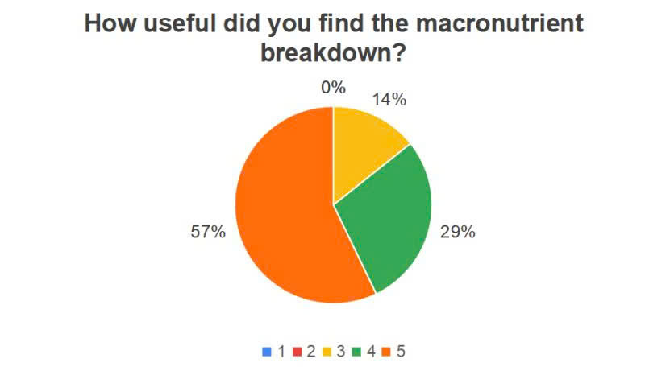
  

  

  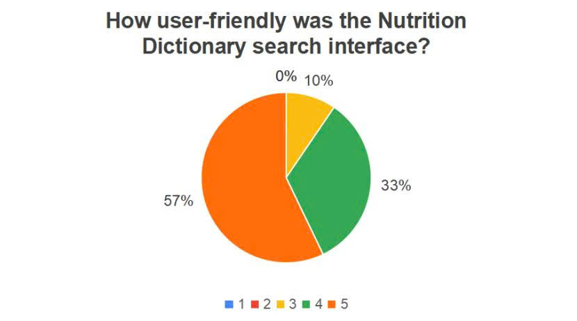
  

  <figcaption>Participants’ evaluation of VietSearch interface
  friendliness</figcaption>
  </figure>

- **Nutrition Dictionary (VietSearch):** Perceived by 90% of
  participants as \"Friendly\" and \"Very Friendly\" as shown in
  Fig. [\[friendlyDic\]](#friendlyDic){reference-type="ref"
  reference="friendlyDic"}, and the same number of participants rated
  \"Accurate\" and \"Very Accurate\". Users appreciated the inclusion of
  local foods and visual presentation. Suggestions included improving
  search (e.g., decimals, voice/image) and adding more detail (e.g.,
  health benefits, origin).

- **AI Chatbot (VietAsk):** Highly praised for speed by 95% of
  participants as \"Responsive\" and \"Very Responsive\" as shown in
  Fig. [\[responsiveAI\]](#responsiveAI){reference-type="ref"
  reference="responsiveAI"}, clarity by 81% of participants as \"Clear\"
  and \"Very Clear\", and helpfulness for navigation by all
  participants; 90% of participants chose \"Helpful\" and \"Very
  Helpful\" as shown in Fig. [7](#helpfulAI){reference-type="ref"
  reference="helpfulAI"}. It significantly enhanced the modern feel,
  though some noted limitations in understanding complex queries or
  maintaining context.

  <figure id="helpfulAI" data-latex-placement="htbp">
  

  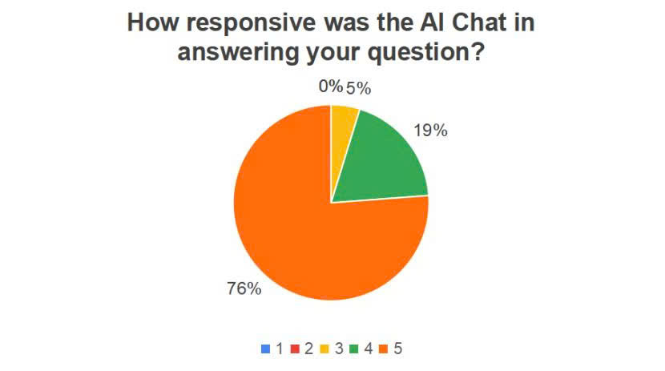
  

  

  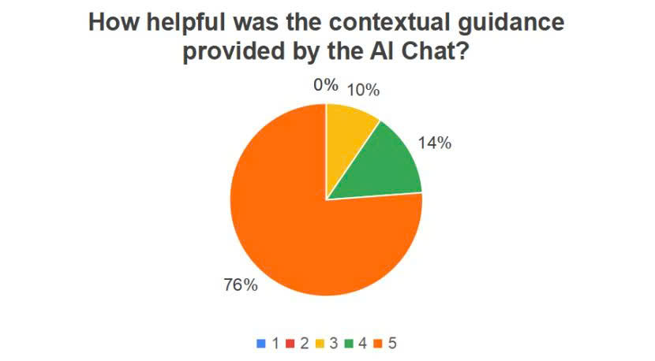
  

  <figcaption>Obtained results showing how helpful participants find in
  contextual guidance of AI Chat</figcaption>
  </figure>

- **Forum (VietMeet) & E-Library (VietSmart):** About 90% of
  participants chose \"Easy\" and \"Very Easy\" to evaluate these
  functionalities as displayed in
  Fig. [\[easyLibrary\]](#easyLibrary){reference-type="ref"
  reference="easyLibrary"}. Participants appreciated the visual design
  and focused nature. Additionally, engagement was recognized a
  significantly high ratio to core planning tools in the tasks, with all
  of participants chose \"Engaging\" and \"Very Engaging\" as shown in
  Fig. [8](#figstudy2){reference-type="ref" reference="figstudy2"}.
  Qualitative feedback suggested potential for deeper features (e.g.,
  tagging, badges for Forum; better file management for E-Library), but
  acknowledged their utility.

<figure id="figstudy2" data-latex-placement="htbp">

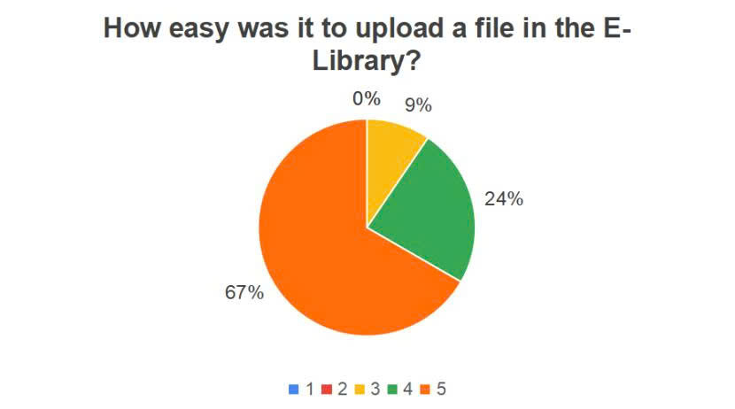

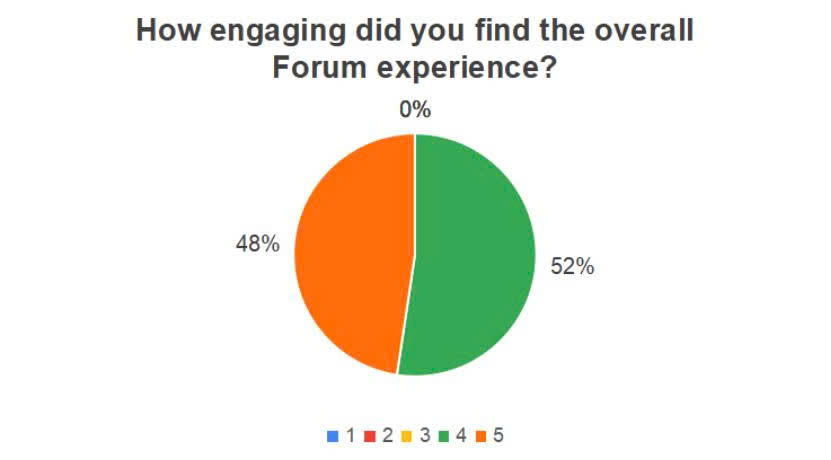

<figcaption>Participants’ evaluation of the overall engagement in Forum
experience</figcaption>
</figure>

## Qualitative Themes & Overall Impressions

For both versions, users appreciated the clarity, good detail,
personalization, and how easy it was to use. Version B clearly did
better than Version A since it demonstrated more of these qualities
through its advanced features. The key points for Version B included how
useful the visual supports were (like videos and pie charts), the
convenience of having every feature together (integration), and what
users saw as new innovation, especially the AI Chatbot.

Common difficulties, which were more observable in Version A but still
relevant, included novice users' understanding of things (like fitness
jargon or how to interpret plans) and small UI/UX issues (e.g., the
button positioning or page scrolling). The ability to be more flexible
and personalized, especially with switching meals, was a major thing
that users wanted to see improved. Overall, users said there was a much
higher chance they would adopt and regularly use Version B when compared
to Version A.

## Discussion of Evaluation Findings

The evaluation results strongly support the hypothesis that a
comprehensive integrated platform (Version B) offers a better user
experience than basic planning tools (Version A). We asked **57
participants** about their needs in Experiment 1 (quantitative needs
assessment), revealing a clear demand for this type of tool in Vietnam.
It showed that users are dissatisfied with current options that are
either too disconnected or insufficiently personal. Secondly, we
conducted a direct A/B usability comparison in Experiment 2 with **21
participants**, demonstrating that Viet MealFit's advanced version
effectively meets these needs.

The positive reaction to improvements like video instruction and food
pie charts highlights how important it is to illustrate information in
another way. Functions that provide more inclusive data and
personalization **(Lean Planner, Nutrition Dictionary)**. The positive
reaction to improvements like video instruction and food pie charts
highlights how important it is to illustrate information in other ways.
Functions that provide more inclusive data and personalization. The **AI
Chatbot**, even though it needs more refinement, was seen as a
remarkable additional benefit, showing that users are looking forward to
getting help from AI features. While community and other useful features
(**Forum, E-Library**) were not the main scope during the tests, the
fact that they worked well suggests they have the potential to encourage
usage and possibly be valuable if we have a strategy to develop them.

The clear fondness that is indicated through Version B confirms our
decision to build a complete, all-in-one platform. It suggests that
users are willing to use a system with more features if it gives them
authentic benefits in managing their health goals easily. The small
usability problems we found give us clear paths for making iterative
improvements. The primary limitation of this study is the small testing
sample (N=21) in the qualitative A/B testing. This means our findings
show strong trends but need to be validated with a larger group of
users.

## Design Implications and Guidelines

Our findings from the development and evaluation of Viet MealFit offer
several actionable guidelines for researchers and designers creating
similar health and wellness applications, particularly for non-Western
contexts.

#### Prioritize an Integrated Core over Fragmented Features.

Our results clearly show that users are burdened by the need to use
multiple apps. A core design principle should be to provide a holistic,
all-in-one solution that seamlessly combines nutrition and exercise
planning. This integration is not just a convenience; it is a primary
driver of user adoption and satisfaction.

#### Deep Cultural Personalization is Highly Desired.

Generic solutions fail because they ignore local context. The positive
reception of the VietSearch dictionary, with its local food items,
proves that cultural relevance is critical. For any target region,
building a comprehensive database of local foods, recipes, and cultural
habits should be a foundational development task, not an afterthought.

#### Enhance Data with Rich Visualizations.

Simply presenting nutritional or exercise data is not enough. The strong
user preference for the nutrient pie charts and embedded exercise videos
highlights the need to make data digestible and actionable. Visual aids
lower the cognitive load for users, especially novices, and
significantly improve clarity and engagement.

#### Introduce Personalized Assistance and Community Features.

While the core planners are essential, features like the AI Chatbot and
the community Forum act as powerful value-adds that enhance the feeling
of a modern, supportive ecosystem. The AI Chatbot was praised for its
innovation and immediate support, suggesting such tools are highly
effective for user engagement. These features can be considered
high-impact additions once the core, personalized functionality is
solid.

# Conclusion and Future Work {#conclude}

This paper presented and evaluated Viet MealFit, an integrated web
platform addressing the critical gaps of fragmentation and cultural
insensitivity in current digital health tools. Our two-part evaluation
confirmed that users strongly prefer an all-in-one, culturally tailored
solution over basic, disconnected planners. Key features enhancing
visualization (food charts), guidance (exercise videos), and
localization (the VietSearch food dictionary) demonstrated that a
unified, user-centered design which embeds cultural relevance is
essential for driving engagement and better supporting comprehensive
health management.

Building on this validation, future work will focus on enhancing the
platform's intelligence, community engagement, and empirical validation.
We plan to deepen personalization by capturing richer user data and
employing deep learning for automated meal detection [@ref28] and
exercise recommendations, while simultaneously expanding our localized
databases (VietSearch, VietMeal) through user contributions.
Furthermore, we will enhance the VietMeet social forum to build a
stronger support ecosystem and conduct larger-scale longitudinal studies
(e.g., SUS) to refine the UI/UX and rigorously validate long-term
effectiveness. These efforts will advance Viet MealFit toward a more
adaptive, culturally aware, and user-centered health ecosystem.

::: thebibliography
99

Y. Li, A. Pan, D. D. Wang, X. Liu, K. Dhana, O. H. Franco, S. Kaptoge,
E. Di Angelantonio, M. Stampfer, W. C. Willett, and F. B. Hu, "Impact of
Healthy Lifestyle Factors on Life Expectancies in the US Population,"
*Circulation*, vol. 138, no. 4, pp. 345--355, Jul. 2018, doi:
<https://doi.org/10.1161/CIRCULATIONAHA.117.032047>.

Ł. Stachera, K. Góras, K. Janowska, E. Muszkat-Pośpiech, A.
Wojciechowska, G. Świderska-Kołacz, S. Zmorzyński, and J.
Czerwik-Marcinkowska, "Potential Benefits of Behaviors and Lifestyle for
Human Health and Well-Being," *Nutrients*, vol. 17, no. 20, Art. no.
3253, 2025, doi: <https://doi.org/10.3390/nu17203253>.

M. Amiri, J. Li, and W. Hasan, "Personalized Flexible Meal Planning for
Individuals With Diet-Related Health Concerns: System Design and
Feasibility Validation Study," *JMIR Formative Research*, vol. 7, 2023,
doi: <https://doi.org/10.2196/46434>.

V. H. N. Nguyen, B. T. Tran, M. V. T. That, and C. T. Vi, "Now I Know
What I Am Eating: Real-Time Tracking and Nutritional Insights Using
VietFood67 to Enhance User Experience," in *Information and
Communication Technology*, W. Buntine, M. Fjeld, T. Tran, M.-T. Tran, B.
H. T. Thanh, and T. Miyoshi, Eds., Singapore: Springer, 2025, pp.
456--470.

X. Xu, S. Tupy, S. Robertson, A. L. Miller, D. Correll, R. Tivis, and C.
R. Nigg, "Successful Adherence and Retention to Daily Monitoring of
Physical Activity: Lessons Learned,"*PLOS ONE*, vol. 13, no. 9, Art. no.
e0199838, Sep. 2018, doi:
<https://doi.org/10.1371/journal.pone.0199838>.

United Nations, *Transforming Our World: The 2030 Agenda for Sustainable
Development*, A/RES/70/1, United Nations General Assembly, New York, NY,
USA, 2015.

Y. Senathirajah, D. R. Kaufman, K. D. Cato, E. M. Borycki, J. A.
Fawcett, and A. W. Kushniruk, "Characterizing and Visualizing Display
and Task Fragmentation in the Electronic Health Record: Mixed Methods
Design," *JMIR Human Factors*, vol. 7, no. 4, Art. no. e18484, Oct.
2020, doi: <https://doi.org/10.2196/18484>.

J. J. Daubenmier, G. Weidner, M. D. Sumner, N. Mendell, T.
Merritt-Worden, J. Studley, and D. Ornish,"The Contribution of Changes
in Diet, Exercise, and Stress Management to Changes in Coronary Risk in
Women and Men in the Multisite Cardiac Lifestyle Intervention Program,"
*Annals of Behavioral Medicine*, vol. 33, no. 1, pp. 57--68, 2007, doi:
<https://doi.org/10.1207/s15324796abm3301_7>.

A. Sharma, G. K. Malik, and T. Kocher, "Personalized Fitness Guidance
Using AI-Driven Recommendation Systems," J. Emerg. Skills Technol., vol.
1, no. 1, pp. 30--37, 2024.

O. Olakotan, R. Samuriwo, H. Ismaila, and S. Atiku, "Usability
Challenges in Electronic Health Records: Impact on Documentation Burden
and Clinical Workflow: A Scoping Review," *Journal of Evaluation in
Clinical Practice*, vol. 31, no. 4, Art. no. e70189, Jun. 2025, doi:
<https://doi.org/10.1111/jep.70189>.

S. Ali and H. Thu, "App Fatigue in mHealth: Beyond Improving Apps,
Advance Equity by Meeting People Where They Are," *PLOS Digital Health*,
vol. 4, 2025, doi: <https://doi.org/10.1371/journal.pdig.0001107>.

A. Nguyen, F. Yu, L. G. Park, Y. Fukuoka, C. Wong, G. Gildengorin, T. T.
Nguyen, J. Y. Tsoh, and J. Jih,"An App-Based Physical Activity
Intervention in Community-Dwelling Chinese-, Tagalog-, and
Vietnamese-Speaking Americans: Single-Arm Intervention Study,"*JMIR
Formative Research*, vol. 8, Art. no. e56373, 2024, doi:
<https://doi.org/10.2196/56373>.

X. Li, A. Yin, H. Y. Choi, V. Chan, M. Allman-Farinelli, and J.
Chen,"Evaluating the Quality and Comparative Validity of Manual Food
Logging and Artificial Intelligence-Enabled Food Image Recognition in
Apps for Nutrition Care,"*Nutrients*, vol. 16, no. 15, Art. no. 2573,
2024, doi: <https://doi.org/10.3390/nu16152573>.

European Commission Directorate-General for Communications Networks,
Content and Technology, *Innovation for Active and Healthy Ageing:
European Summit on Innovation for Active and Healthy Ageing, Final
Report*, Brussels, Belgium, Mar. 9--10, 2015, doi:
<https://doi.org/10.2759/472427>.

J. Pols, D. Willems, and M. Aanestad,"Making Sense with Numbers:
Unravelling Ethico-Psychological Subjects in Practices of
Self-Quantification,"*Sociology of Health & Illness*, vol. 41, pp.
98--115, 2019, doi: <https://doi.org/10.1111/1467-9566.12842>.

R. Berry, A. Kassavou, and S. Sutton, "Does self-monitoring diet and
physical activity behaviors using digital technology support adults with
obesity or overweight to lose weight? A systematic literature review
with meta-analysis,"*Obesity Reviews*, vol. 22, no. 10, Art. e13306,
2021.

M. L. Patel, L. N. Wakayama, and G. G. Bennett, "Self-Monitoring via
Digital Health in Weight Loss Interventions: A Systematic Review Among
Adults with Overweight or Obesity,"*Obesity*, vol. 29, no. 3,
pp. 478--499, 2021.

H. Giao, "Study of the factors affecting customers' loyalty for gym
service at K.I.M Center, Vietnam," Feb. 2020. \[Online\]. Available:
<https://doi.org/10.31219/osf.io/57g8a>

World Health Organization, "Probability of dying between age 30 and
exact age 70 from any of cardiovascular diseases, cancer, diabetes or
chronic respiratory diseases (SDG indicator 3.4.1),'' WHO Data
(Indicator ID 1F96863), 2024. Available:
<https://data.who.int/indicators/i/C540135/1F96863?m49=704> (accessed 31
Oct 2025).

T. T. Nguyen and M. V. Hoang, "Non-communicable diseases, food and
nutrition in Vietnam from 1975 to 2015: the burden and national
response," *Asia Pacific Journal of Clinical Nutrition*, vol. 27, no. 1,
pp. 19--28, 2018.

T. N. Nguyen and H. K. Bui, "BIC algorithm for exercise behavior at
customers' fitness center in Ho Chi Minh City, Vietnam," in
*Applications of Artificial Intelligence and Machine Learning*,
B. Unhelker, H. M. Pandey, and G. Raj, Eds. Singapore: Springer Nature
Singapore, 2022, pp. 181--191.

A. Nazarenko, "Updating the Contemporary Business Model for Fitness
Market," B. Sc. thesis, Jyväskylä University of Applied Sciences, 2020.
\[Online\]. Available: <https://urn.fi/URN:NBN:fi:amk-2020121628628>

D. H. Brahmbhatt, H. J. Ross, and Y. Moayedi, "Digital technology
application for improved responses to health care challenges: Lessons
learned from COVID-19," *Canadian Journal of Cardiology*, vol. 38,
no. 2, pp. 279--291, 2022. \[Online\]. Available:
<https://doi.org/10.1016/j.cjca.2021.11.014>

M. A. Bernstorff, N. Schumann, A. Finke, T. A. Schildhauer, and
M. Königshausen, "Popular gym fitness sport: An analysis of 1387
recreational athletes regarding prone to pain exercises and the
corresponding localisations," *Sports*, vol. 12, no. 1, p. 12, 2024.
\[Online\]. Available: <https://doi.org/10.3390/sports12010012>

F. Bert, G. Scaioli, M. Tolomeo, G. Lo Moro, M. Gualano, and
R. Siliquini, "Knowledge, attitudes and eating habits of red and
processed meat among gym users: A cross-sectional survey," *Perspectives
in Public Health*, vol. 140, no. 4, pp. 203--213, 2019. doi:
[10.1177/1757913919883908](10.1177/1757913919883908){.uri}

T. T. K. Le, T. T. B. Tran, H. T. M. Ho, *et al.*, "Prevalence of food
allergy in Vietnam: Comparison of web-based with traditional paper-based
survey," *World Allergy Organization Journal*, vol. 11, p. 16, 2018.
\[Online\]. Available: <https://doi.org/10.1186/s40413-018-0195-2>

H. K. Larson, K. McFadden, T.-L. F. McHugh, T. R. Berry, and W. M.
Rodgers, "When you don't get what you want---and it's really hard:
Exploring motivational contributions to exercise dropout," *Psychology
of Sport and Exercise*, vol. 37, pp. 59--66, 2018. \[Online\].
Available: <https://doi.org/10.1016/j.psychsport.2018.04.006>

U.S. Food and Drug Administration (FDA), "Food Allergies: What You Need
to Know," Apr. 2, 2024. \[Online\]. Available:
<https://www.fda.gov/food/buy-store-serve-safe-food/food-allergies-what-you-need-know>

MEDLATEC General Hospital, "Nhung sai lam khien tap gym khong lên co ban
nen tranh," Jul. 29, 2021. \[Online\]. Available:
<https://medlatec.vn/tin-tuc/nhung-sai-lam-khien-tap-gym-khong-len-co-s195-n23850>

Liang, S. et al.: Understanding the paths and patterns of app-switching
in mobile search and usage. *Sustainability / Mobile HCI proceedings*
(2022). <https://www.mdpi.com/2071-1050/14/20/12992>

M. Forsberg, M. Fagerström, H. Lorin, and T. Järkesten, "An evaluation
of a meal planning system: ease of use and perceived usefulness," in
Proc. 2nd ACM SIGCHI Symp. Eng. Interact. Comput. Syst. (EICS '10),
Berlin, Germany, Jun. 19--23, 2010, pp. 211--216. DOI:
10.1145/1822018.1822052.

S. Ramesh and K. C. R., "Workout Whiz -- Your Personalized AI PAL," in
2024 Int. Conf. Intell. Data Commun. Technol. Internet Things (IDCIoT),
Bengaluru, India, Jan. 24--26, 2024, pp. 406--411. DOI:
10.1109/IDCIoT58675.2024.10455053.

Z. E. L. Tan et al., "Activity Tracker--Based Metrics as Digital Markers
of Cardiometabolic Health in Working Adults: Cross-Sectional Study,"
JMIR mHealth uHealth, vol. 8, no. 1, p. e16409, Jan. 2020. DOI:
10.2196/16409.

J.S. Williams, "Cook-it!: A Web Application for Meal Planning," Senior
Thesis, University of South Carolina, Columbia, SC, 2019. \[Online\].
Available:
<https://scholarcommons.sc.edu/cgi/viewcontent.cgi?article=1557&context=senior_theses>

Z. Tan, J. Chen, J. Zhang, and M. Zheng, "Research and practice of meal
allocation algorithm based on SARSA algorithm and multi-objective
optimization," in Proc. 6th Int. Conf. Big Data Artif. Intell. (BDAI
2024), Guangzhou, China, Jul. 5--7, 2024, pp. 45--51. DOI:
10.1145/3708597.3708614.

T. Oliveira, D. Leite, and G. Marreiros, "PersonalFit: Fitness app with
intelligent plan generator," in *Proc. 9th Int. C Conf. Computer Sci. &
Software Eng. (C3S2E '16)*, Porto, Portugal, 2016, pp. 127--128. doi:
[10.1145/2948992.2949014](10.1145/2948992.2949014){.uri}

A. Darejeh, H. Haddadpajouh, and A. Darejeh, "An investigation on the
use of expert systems in developing web-based fitness exercise plan
generator," *Int. Rev. Comput. Softw.*, vol. 9, pp. 1442--1448, Aug.
2014. doi: [10.15866/irecos.v9i8.2951](10.15866/irecos.v9i8.2951){.uri}

S. N. Papadoudis et al., "PERFECT: Personalized Exercise Recommendation
Framework and architecture," \*ACM Trans. Comput. Healthcare, vol. 5,
no. 3, Article 52, Jul. 2024. DOI: 10.1145/3696425.

A. Zulfiqar et al., "A personalized agent-based chatbot for nutritional
coaching," in Proc. 15th Int. Conf. Pervasive Technol. Relat. Assistive
Environ. (PETRA '22), Corfu, Greece, Jun. 29--Jul. 1, 2022, pp.
181--188. DOI: 10.1145/3529190.3534762.

W. Gao et al., "Wearable and Mobile Sensors for Personalized Nutrition,"
ACS Sensors, vol. 6, no. 5, pp. 1748--1771, Apr. 2021. DOI:
10.1021/acssensors.1c00553.

A. Mukhopadhyay et al., "Insights into Gen Z online food ordering
behavior: leveraging eye-tracking and AI for cognitive analysis,"
\*Behav. Insights J., Early Cite, 2024. DOI: 10.1108/BIJ-12-2023-0030.

Y. Pan et al., "Elliptical4VR: An Interactive Exergame Authoring Tool
for Personalized Elliptical Workout Experience in VR," in \*Proc. 2023
ACM Symp. Virtual Real. Softw. Technol. (VRST '23), Christchurch, New
Zealand, Oct. 9--11, 2023, Article 62. DOI: 10.1145/3591156.3591172.

M. Keshavarzi et al., "Virtual-GymVR: A Virtual Reality Platform for
Personalized Exergames," in \*2024 IEEE Conf. Virtual Real. 3D User
Interfaces Abstr. Workshops (VRW), Orlando, FL, USA, Mar. 16--21, 2024,
pp. 468--469. DOI: 10.1109/VRW62533.2024.00098.

J. Domínguez-Rodríguez et al., "MEAL PLATFORM, A TOOL TO HELP EDUCATORS
TO LEARN AND TRANSFER NUTRITIONAL EDUCATION TO CHILDREN," in
\*EDULEARN15 Proc., Barcelona, Spain, Jul. 6--8, 2015, pp. 4182--4188.

Y. Li et al., "Users preferences and design recommendations to promote
engagements with mobile apps for diabetes self-management:
Multi-national perspectives," PLoS ONE, vol. 13, no. 12, p. e0208942,
Dec. 2018. DOI: 10.1371/journal.pone.0208942.

P. Baumann and A. Hahn, "Expert Exercise Planner - Detailed tracking of
workout metrics," in Companion Proc. Web Conf. 2018 (WWW '18), Lyon,
France, Apr. 23--27, 2018, pp. 1179--1182. DOI: 10.1145/3184558.3186989.
:::
