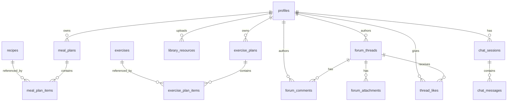
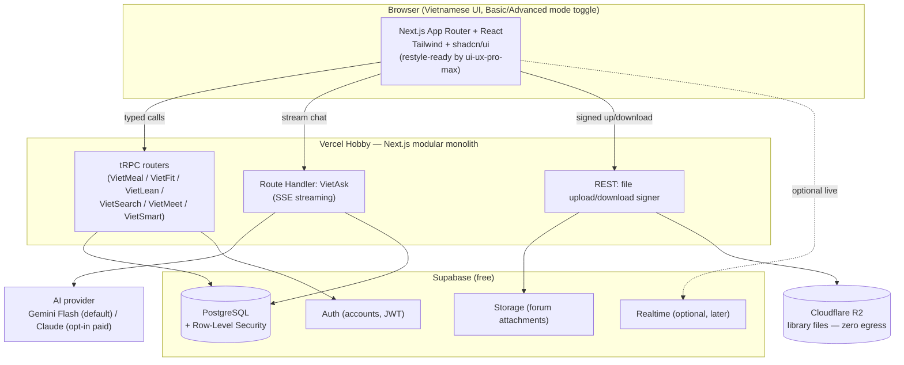

# VietMealFit — Full-Stack Rebuild: Technical Architecture & Implementation Plan

**Status:** Planning complete, decisions confirmed. Ready for Phase 0 on your signal.
**Basis:** Faithful extraction of `paper_draft/main.md` + all 14 figures (see `vietmealfit_paper_extraction.md`, produced this session), reviewed critically against project-owner hard requirements.
**Nature of the source project:** Greenfield rebuild. No original VietMealFit source code exists or was ever provided — the paper describes a static-data academic prototype (JS arrays + browser localStorage + a third-party chatbot embed), not a real deployable system. This plan re-derives a production-appropriate architecture from first principles while preserving exact functional fidelity to what the paper's user study (N=21, within-subjects A/B) actually evaluated.

---

## 0. Confirmed Decisions (resolved 2026-07-24)

These were raised as open forks during planning and have now been decided. They are treated as settled for all sections below.

| # | Decision | Resolution |
|---|---|---|
| D1 | **Scope: Basic Version A vs. Advanced Version B** | **Both, via a real "Experience Mode" toggle.** Not just a study artifact — a shippable Basic/Advanced switch. See §1.1 and §7.1. |
| D2 | **Authentication strategy** | **Hybrid.** Anonymous browsing everywhere; an account is required only to save a profile, generate/persist plans, post to VietMeet, upload to VietSmart, or keep VietAsk chat history. |
| D3 | **VietSearch nutrition data sourcing** | **Resolved — real official data already in hand.** User-supplied CSV (`D:\UIST_2026\data_v2.csv`): ~526 Vietnamese food items digitized from *"Bảng thành phần thực phẩm Việt Nam"* (Vietnamese Food Composition Table), Bộ Y Tế – Viện Dinh dưỡng (Ministry of Health – National Institute of Nutrition), 2007. Full macro + micronutrient + amino-acid + fatty-acid profile, Vietnamese and English names. This is the authoritative source the paper itself was approximating — no licensing ambiguity to carry forward; the app will cite this source in-app (see §5.1). |
| D4 | **AI provider for VietAsk** | **Free-tier by default.** Provider-abstraction layer; default model is a free-tier LLM (e.g. Google Gemini Flash); Claude/other paid models available as an opt-in upgrade path, never required. |
| D5 | **Admin role** | Not asked explicitly — kept as the planning agent's low-risk default: a lightweight RBAC flag (`role = admin`) for moderation, no bespoke admin UI in early phases (use Supabase's dashboard directly). Revisit if/when VietMeet/VietSmart content volume warrants a real admin panel. |

---

## 1. Business / Functional Requirements — Module by Module

### 1.1 Experience Mode (new, cross-cutting — resolves D1)

Per the paper, the study compared two conditions:
- **Basic (A):** VietMeal + VietFit only, text-only output, no visualizations, no AI, no community/library modules.
- **Advanced (B):** All 7 modules, macronutrient pie charts, embedded exercise videos, AI chatbot (VietAsk).

Because the user wants this preserved as a real feature (not just historical study scaffolding), the product will ship with a **persistent, user-facing "Basic / Advanced" mode toggle** (default: Advanced). This is implemented as a single capability flag consulted by every module's UI, not as two separate codebases:

- **Basic mode** shows only VietMeal + VietFit, with plain-text/tabular output (no pie chart, no embedded video, no AI dock, nav collapses to 2 items).
- **Advanced mode** shows all 7 modules, pie charts, embedded videos, the AI chatbot dock, and cross-module linking ("Check VietLean for your calorie needs").
- The toggle lives in the user's profile/settings (persisted for logged-in users; session-only for anonymous users) and can also be deep-linked (`?mode=basic`) — useful if you ever want to run a follow-up comparative study, which the paper explicitly flags as necessary future validation (N=21 was small).
- Architecturally this is a **single boolean/enum gate read by feature components**, not a fork of the codebase — see §7.1 for the implementation pattern. This keeps it cheap to maintain and avoids the two-version drift that would otherwise double QA surface area.

### 1.2 VietMeal — Personalized Meal Planner
- **User does:** enters body measurements, optional calorie goal, dietary choice (Anything / Keto / Vegan / …), allergies; clicks Generate; receives breakfast/lunch/dinner for a day and a navigable **week**; (Advanced) views a **macronutrient pie chart**; ticks **tracking checkboxes**; downloads plan as text; can request specific targets (e.g. high-protein).
- **Data needed:** a **recipe catalog** — name, meal type, diet tags, per-serving calories + macros, ingredients, instructions, allergen tags.
- **Cross-links (Advanced only):** BMI feedback and CTAs to VietLean and VietSearch.
- **Out of scope now:** auto meal-swapping AI, photo logging (paper's own future work).

### 1.3 VietFit — Personalized Exercise Planner
- **User does:** enters gender, age, height, weight, experience level, physical limitations, fitness goal, preferred cardio; gets a **chronological daily schedule** with exercises, sets, rep ranges; sees BMI + personalized recommendation; (Advanced) clicks an exercise to see targeted muscles and an **embedded instructional video**; ticks progress checkboxes; downloads as text.
- **Data needed:** an **exercise catalog** — name, muscle groups, equipment, difficulty, default sets/rep scheme, instructional video URL (YouTube), limitation/contraindication tags.
- **Out of scope now:** ML-driven routine generation (rule/template-based generation is in scope).

### 1.4 VietLean — Calorie & Macronutrient Calculator *(Advanced only)*
- **User does:** enters weight, selects phase (Bulking / Lean / Cutting); receives daily calorie target, macro breakdown, recommended food categories.
- **Data needed:** formula-driven computation + a small reference table of food-category recommendations per phase.

### 1.5 VietSearch — Vietnamese Nutrition Dictionary *(Advanced only)*
- **User does:** picks a food ingredient, enters grams (min 100), gets calories/protein/carb/fat with **emoji indicators** — matching the paper's exact display.
- **Data needed:** now resolved via D3 — see §5.1 for schema and §8 Phase 1 for the import plan.
- **Study-requested improvements (nice-to-have, not core):** decimal gram input, voice/image search, health-benefit/origin metadata (the CSV actually already carries enough fields — vitamins, region-adjacent categories — to support a richer "Full Nutrition Facts" expansion later at low marginal cost; flagged as a Phase 3.5 stretch, see §8).

### 1.6 VietMeet — Community Forum *(Advanced only — paper flaw to fix)*
- **User does:** create threads (title, description, content), attach images/files, comment (text + emoji + image), like, delete, search threads, sort (Newest→Oldest).
- **Paper flaw:** stored in browser **localStorage** → never actually shared between users or devices, contradicting the paper's own "community forum" framing. **Rebuild requires real shared DB + object storage**, and real authorship (fixing the hardcoded "Aaron").
- **Auth interaction (D2):** thread/comment reading is public; posting/liking/deleting requires an account.

### 1.7 VietSmart — E-Library *(Advanced only — paper flaw to fix)*
- **User does:** upload fitness resources (articles/guides/docs), share, search, sort, preview, download.
- **Paper flaw:** files + metadata in localStorage → not a real "central repository." **Rebuild requires real object storage + shared metadata DB.**
- **Auth interaction (D2):** browsing/downloading is public; uploading requires an account.

### 1.8 VietAsk — AI Chatbot *(Advanced only — replaces third-party embed)*
- **User does:** asks navigation questions + general fitness Q&A; gets real-time, Vietnamese-capable conversational answers primed with platform-specific knowledge.
- **Paper implementation:** third-party **Chatling** embed (a black box, no data control). **Rebuild replaces this with a first-party integration** (D4) so we control model, prompt, cost, and can inject platform context.
- **Known limitation from the study:** weak on complex queries and cross-turn context — mitigated by storing message history server-side per session (paper's Chatling likely didn't).

### 1.9 Cross-cutting
- **User profile** feeds all modules (the paper's "linked user experience") — body measurements, goals, dietary preference, allergies, experience mode preference (§1.1).
- **New requirement not in the paper:** a visible **"not medical advice" disclaimer**. The app dispenses calorie targets and exercise routines; the paper never addressed liability. This is a deliberate, small addition.
- **Explicitly out of scope for the core rebuild** (paper's own stated future work — not part of the evaluated contribution): deep-learning meal-photo detection, ML-driven exercise recommendation. Carried as Phase 9+ stretch only.

---

## 2. Tech Stack Decision (with tradeoffs)

Guiding constraints, in the project owner's words: efficient, modular, scalable, easy to deploy the **whole system** for free, and the frontend must be trivially restyle-able later by the `ui-ux-pro-max` skill (which has first-class support for React / Next.js / Tailwind / shadcn/ui).

### 2.1 Frontend framework → **Next.js 15 (App Router) + React + TypeScript**
| Considered | Verdict |
|---|---|
| **Next.js App Router** ✅ | `ui-ux-pro-max` targets exactly this stack; full-stack monolith = one deploy; server components cut client JS; best free-tier DX on Vercel |
| Vite + React SPA | Needs a separate backend → two deploys, works against "deploy the whole system easily" |
| Remix / React Router 7 | Solid but weaker fit with the redesign skill's tooling |
| SvelteKit / Nuxt | Good tech, but throws away requirement #3 (redesign-skill fit) entirely |

Requirement #3 effectively decides this on its own: anything but React/Next/Tailwind/shadcn makes the later UI/UX pass fight the architecture instead of gliding through it.

### 2.2 Styling / design system → **Tailwind CSS + shadcn/ui, from day one, even with placeholder styling**
- shadcn/ui components live **in-repo** (not a locked npm dependency) → the redesign skill can restyle them directly, not around them.
- Design tokens as CSS variables (`globals.css`) + Tailwind theme → a full visual redesign becomes a token/variant swap, not a rewrite. This directly targets the paper's own worst UI trait (hardcoded green-on-black/white, no system).
- MUI/Chakra/Mantine rejected: too opinionated, harder to fully restyle, weaker fit with the redesign skill.

### 2.3 Backend → **Next.js as a modular monolith** (Route Handlers + Server Actions)
| Considered | Verdict |
|---|---|
| **Next.js modular monolith** ✅ | One codebase, one deploy; module-per-folder gives real modularity without distributed-systems overhead; simplest free-tier story |
| Separate NestJS/Fastify service | Cleaner separation, independent scaling — but two deploys, more infra/cost, premature at this scale |
| Serverless-only | Already what Next Route Handlers give you |

Modularity is enforced by **feature-folder boundaries**, not network boundaries. Any module can be extracted into its own service later if it ever needs independent scaling — nothing here forecloses that.

### 2.4 API protocol → **tRPC for CRUD modules + SSE for VietAsk**
| Considered | Verdict |
|---|---|
| **tRPC** ✅ (VietMeal/Fit/Lean/Search/Meet/Smart) | End-to-end TS type safety, zero codegen, fastest velocity in a single TS repo, one router per module = clean modularity |
| REST | Kept for file upload/download and as the AI streaming transport — tRPC is awkward for token streaming |
| GraphQL | Over-engineered here — no query-shape problem to justify schema+resolver overhead |

Deliberate hybrid: tRPC for typed CRUD, a plain streaming Route Handler (SSE) for VietAsk, plain REST for file up/download, Server Actions for simple form mutations. Honest caveat: tRPC couples client/server to TypeScript — acceptable for a single-repo app; if a future public/mobile client is needed, the REST endpoints already establish that pattern.

### 2.5 Database → **PostgreSQL**
Every module is strongly relational (forum→comments→likes→attachments; users→plans→items; nutrition items with structured nutrient fields). Postgres beats MongoDB (no real relational needs served by document flexibility here) and MySQL/PlanetScale (PlanetScale dropped its free tier in 2024 ⚠ verify current status — a wall to avoid).

**ORM → Drizzle** (SQL-first, lightweight, serverless-friendly cold starts) preferred; Prisma acceptable if migration-tooling maturity is valued over cold-start weight.

### 2.6 The pivotal bundling decision → **Supabase (Postgres + Auth + Storage + Realtime) as the backbone**
| Option | Pros | Cons |
|---|---|---|
| **Supabase** ✅ | One free platform delivers DB + real Auth + S3-compatible Storage + Row-Level Security + optional Realtime — directly satisfies "deploy the whole system easily," real auth (D2), real persistence | Free project **pauses after ~7 days inactivity** (a demo-day gotcha — needs a keep-alive ping); ~500MB DB / ~1GB storage ceilings ⚠ verify current limits |
| Neon + Clerk + R2 (best-of-breed per layer) | Each individually excellent | 3 vendors to wire and deploy — works against "easy to deploy the whole system" |

**Recommendation, carried forward:** Supabase as the backbone, with **VietSmart file storage offloaded to Cloudflare R2** (10GB free, zero egress fees) since the library is download-heavy and storage/egress is the first wall Supabase's free tier hits (§4). Forum image attachments can stay in Supabase Storage (lighter volume); large library documents go to R2.

### 2.7 Auth provider → **Supabase Auth**
Bundled with the DB choice, integrates directly with Row-Level Security (owners edit their own profile/plans; forum/library readable by all, writable by authenticated authors; admin role bypasses for moderation per D5). Email + OAuth, free to a high MAU ceiling ⚠ verify current limit. Clerk/Auth.js considered and rejected: Clerk adds a vendor and a prebuilt UI that complicates a from-scratch redesign; Auth.js is more self-managed work for no real benefit given we're already committed to Supabase.

### 2.8 Real-time → **not needed at launch**
VietMeet does not need live push. Client-side revalidation (TanStack Query / Next cache, fetch-on-focus) is simpler and cheaper. Supabase Realtime stays available to add later only if engagement data justifies it — don't pre-build it.

### 2.9 Charts & video
- **Recharts** for the macronutrient pie charts (pairs naturally with React/shadcn; consult the `dataviz` skill when building these for color/accessibility guidance).
- Exercise videos: **embed YouTube** via stored `video_url` — matches the paper, zero hosting cost.

### 2.10 AI provider abstraction (D4)
Build against a provider-abstraction layer (e.g. the Vercel AI SDK) so the model is a config value, not a rewrite. Default: a free-tier model (Gemini Flash is the leading candidate — strong Vietnamese support, genuine free tier ⚠ verify current rate limits at build time). Claude or another paid model becomes a pure config swap if quality needs later justify cost.

---

## 3. Free-Tier Deployment Architecture

| Layer | Service | Free-tier reality (⚠ verify at build time) | First wall |
|---|---|---|---|
| Frontend + API (Next.js) | **Vercel Hobby** | ~100GB bandwidth/mo; serverless function duration limits; non-commercial clause | AI streaming near function-duration limits → mitigate with Edge streaming |
| DB + Auth + Storage + Realtime | **Supabase Free** | ~500MB DB, ~1GB storage, ~5GB egress, high MAU ceiling; **pauses after ~7 days inactivity** | Storage fills with library files first; project pause = cold demo without a keep-alive |
| Object storage (heavy files) | **Cloudflare R2 Free** | ~10GB storage, **$0 egress**, op-count limits | Very high ceiling for this project's scale |
| AI (VietAsk) | **Gemini Flash free tier** (default) / Claude (opt-in paid) | Rate-limited free tier ⚠ verify | Rate limits under demo-day concurrent load |

**Deployment topology:** Vercel (Next.js monolith) ⇄ Supabase (Postgres/Auth/Storage/Realtime) ⇄ Cloudflare R2 (library files) ⇄ Gemini/Claude API (VietAsk). CI/CD: GitHub → Vercel preview deploys per PR; Drizzle migrations run in CI against Supabase.

**Honest cost truth:** "free forever" holds at demo/conference scale, not indefinitely. Realistic first paid dollars, in order: (1) Supabase Pro (~$25/mo) if you outgrow storage/DB or want to stop the pause behavior; (2) AI usage beyond free rate limits; (3) Vercel Pro only if traffic/commercial use grows. None of these are hit at the scale this project needs for a conference demo and continued small-scale use.

---

## 4. Data Model



**Entities & key fields:**

- **profiles** — `id (→auth.users)`, `display_name`, `role (user|admin)`, `gender`, `age`, `height_cm`, `weight_kg`, `experience_level`, `fitness_goals[]`, `dietary_preference`, `allergies[]`, `calorie_goal`, `experience_mode (basic|advanced, default advanced)`.
- **recipes** *(VietMeal)* — `id`, `name_vi/en`, `meal_type`, `diet_tags[]`, `calories`, `protein_g`, `carb_g`, `fat_g`, `ingredients (jsonb)`, `instructions`, `allergen_tags[]`, `source`.
- **meal_plans / meal_plan_items** — plan: `user_id`, `week_start`, `params (jsonb snapshot)`; item: `plan_id`, `day`, `meal_type`, `recipe_id`, `completed (bool)`.
- **exercises** *(VietFit)* — `id`, `name`, `muscle_groups[]`, `equipment`, `difficulty`, `default_sets`, `rep_scheme`, `video_url`, `instructions`, `limitation_tags[]`.
- **exercise_plans / exercise_plan_items** — plan: `user_id`, `params`, `goal`; item: `plan_id`, `day`, `order`, `exercise_id`, `sets`, `rep_scheme`, `completed`.
- **forum_threads** *(VietMeet)* — `id`, `author_id`, `title`, `description`, `content`, `created_at`, `like_count (denormalized)`.
- **forum_comments** — `id`, `thread_id`, `author_id`, `content`, `created_at`.
- **thread_likes / comment_likes** — `(user_id, target_id)` unique → real like semantics, fixing the paper's fake localStorage likes.
- **forum_attachments** — `id`, `thread_id?/comment_id?`, `storage_path`, `filename`, `mime`, `size`.
- **library_resources** *(VietSmart)* — `id`, `uploader_id`, `title`, `description`, `category`, `storage_path (R2)`, `filename`, `mime`, `size`, `download_count`, `created_at`.
- **chat_sessions / chat_messages** *(VietAsk)* — session: `user_id (nullable — anonymous chat allowed)`, `created_at`; message: `session_id`, `role`, `content`, `created_at`.
- **VietLean** — no table; pure computation + a static `phase_food_recommendations` reference (seed data).

Access control: **Supabase Row-Level Security** — owners edit their own profile/plans; forum/library readable by all (D2: anonymous read), writable only by authenticated authors; admin role (D5) bypasses for moderation.

### 4.1 nutrition_items — VietSearch (updated per D3)

Source of truth: `data_v2.csv` (526 rows), from *Bảng thành phần thực phẩm Việt Nam*, Bộ Y Tế – Viện Dinh dưỡng, 2007. Columns observed in the file: `STT` (row #), `Food_Code`, `Food_Name_Vietnamese`, `Food_Name_English`, `Waste_Pct_%`, `Water_g`, `Energy_kcal`, `Energy_kj`, `Protein_g`, `Fat_g`, `Carbohydrate_g`, `Fiber_g`, `Ash_g`, sugars (total/galactose/maltose/lactose/fructose/glucose/sucrose), ~15 minerals/vitamins (calcium, iron, magnesium, manganese, phosphorus, potassium, sodium, zinc, copper, selenium, vitamin C/B1/B2/B3/B5/B6/B12, folate, biotin, vitamin A/D/E/K, carotenoids), purines, isoflavones, a full fatty-acid panel (SFA/MUFA/PUFA breakdown, cholesterol, phytosterol), and a full amino-acid panel (lysine, methionine, tryptophan, etc.).

**Schema strategy:**
- First-class columns for the fields the paper's UI actually displays and that benefit from indexing/sorting: `food_code (unique)`, `name_vi`, `name_en`, `category` (derive from STT ranges or Food_Code prefix — needs a one-time classification pass), `energy_kcal`, `protein_g`, `fat_g`, `carbohydrate_g`, `fiber_g`.
- `extended_nutrients (jsonb)` — everything else (vitamins, minerals, fatty acids, amino acids), preserved losslessly for the Phase 3.5 "Full Nutrition Facts" stretch feature (§8), without bloating the core query path.
- `source_citation` (constant): *"Bảng thành phần thực phẩm Việt Nam, Bộ Y Tế – Viện Dinh dưỡng, 2007"* — displayed in the VietSearch UI footer, consistent with the paper's own practice of citing its data provenance.

**Data-quality note:** many rows have sparse micronutrient fields (blank cells in the CSV) — this is a real limitation of the 2007 table for less-common items, not an import bug. Phase 1 import must treat blank as `NULL` (unknown), and the UI must render "data not available" rather than defaulting to 0, since 0 would misrepresent unmeasured nutrients as absent.

**Import task (Phase 1):** copy `data_v2.csv` into the repo as `data/seed/vietnam_food_composition_2007.csv`, write a one-time seed script (CSV → `nutrition_items`), and do a light category-tagging pass (the paper's dictionary demo used categories like "Fish" — the raw CSV doesn't appear to carry a clean category column, so this needs a manual/semi-automated pass, likely grouped by `STT`/`Food_Code` numeric ranges which conventionally group food classes in Vietnamese composition tables — confirm exact ranges when the file is opened in full during Phase 1).

---

## 5. Architecture Diagram



---

## 6. Frontend Structure for `ui-ux-pro-max` Compatibility

Goal: a later full visual redesign is a low-friction restyle, never a rewrite.

**Principles**
1. **shadcn/ui from day one**, even with placeholder styling. Logic ships against stable component APIs; the redesign pass restyles `components/ui/*` and swaps tokens.
2. **All design decisions live in tokens** — colors/spacing/radius/typography as CSS variables + Tailwind theme. No hardcoded hex (directly fixes the paper's `#00FF00`-on-black problem). Redesign = edit tokens + variants.
3. **Strict presentation/logic separation** — data fetching in server components / tRPC hooks; UI components are dumb, prop-driven, side-effect-free.
4. **Feature-folder modularity** mirroring the 7 modules.
5. **One app shell** (nav + breadcrumb + floating VietAsk dock, gated by experience mode) — redesign the shell once, all modules inherit it.
6. **Semantic Tailwind classes** mapped to tokens (`bg-primary`, never `bg-[#00FF00]`) so the redesign skill can remap the whole palette centrally.

### 6.1 Experience Mode implementation pattern (D1)
A single `useExperienceMode()` hook (reading from profile for logged-in users, session/query-param for anonymous) returns `"basic" | "advanced"`. Feature components consult it to conditionally render (e.g. `<PieChart>` only renders if `mode === "advanced"`). This keeps Basic/Advanced as a **rendering concern**, not a routing or data-layer fork — VietMeal/VietFit logic and data don't change between modes, only which UI affordances are shown. Modules unique to Advanced (VietLean, VietSearch, VietMeet, VietSmart, VietAsk) are simply nav-hidden and route-guarded in Basic mode.

```
app/
  (marketing)/            # public landing
  (app)/
    vietmeal/  vietfit/  vietlean/
    vietsearch/  vietmeet/  vietsmart/
    layout.tsx            # single app shell (nav, breadcrumb, chatbot dock)
components/ui/            # shadcn primitives (redesign target)
components/shared/        # cross-module presentational components
features/
  vietmeal/{components,hooks,api,types}
  vietfit/ ... (per module)
  experience-mode/         # the basic/advanced gate, shared across modules
server/
  routers/ (tRPC per module)  db/ (drizzle schema)  ai/ (VietAsk)
lib/  styles/globals.css (tokens)
data/seed/vietnam_food_composition_2007.csv
```

**Net effect:** the UI/UX pass edits `styles/globals.css`, `tailwind.config`, `components/ui/*`, and the shell — and never touches `server/`, `features/*/api`, `features/*/hooks`, or the data model.

---

## 7. Multi-Phase Implementation Roadmap

No code is written in this plan — sequencing and deliverables only.

| Phase | Goal | Key deliverables | Depends on |
|---|---|---|---|
| **0 — Foundations / Infra** | Deployable empty shell | Next.js+TS+Tailwind+shadcn scaffold; Supabase project; Drizzle wired; Vercel CI/CD w/ preview deploys; tokens + app shell + placeholder nav; Experience Mode hook stubbed | — |
| **1 — Data modeling + nutrition import** | Real schema + real data | Full Drizzle schema + RLS; import `data_v2.csv` → `nutrition_items` (526 items, category-tagging pass, NULL-safe micronutrients); seed recipe + exercise catalogs | 0 |
| **2 — Core planners (VietMeal, VietFit, VietLean)** | The paper's evaluated core, in both modes | Meal-plan generation + week nav + (Advanced) pie chart + tracking; exercise plan + BMI + muscle info + (Advanced) embedded video + tracking; VietLean calculator (Advanced-only); **Basic/Advanced toggle wired end-to-end** | 1 |
| **3 — VietSearch** | Nutrition dictionary | Search/select UI, gram input (min 100), emoji nutrient display, source citation footer; wired to `nutrition_items` | 1 |
| **3.5 — Stretch: Full Nutrition Facts panel** | Exploit the rich dataset already imported | Expandable panel surfacing vitamins/minerals/fatty acids/amino acids from `extended_nutrients` — cheap add given the data's already there | 3 |
| **4 — VietMeet + VietSmart (real persistence)** | Fix the localStorage flaw | Threads/comments/likes/attachments in Postgres+Storage; library upload/preview/download via R2; search/sort; anonymous-read/auth-write per D2 | 1; Supabase Auth wired |
| **5 — VietAsk** | First-party AI, replacing Chatling | Provider abstraction (Vercel AI SDK); streaming SSE; server-side session history; platform-context grounding; defaults to free-tier model per D4 | 0 |
| **6 — UI/UX redesign pass** | Replace the dated visual design | Run `ui-ux-pro-max`; restyle tokens + `components/ui` + shell; dark/light; responsive; accessibility pass | 2–5 feature-complete |
| **7 — Testing / QA** | Correctness + safety | Unit tests (calorie/BMI/macro calculators must be numerically correct), integration (tRPC + RLS), E2E happy paths for both Experience Modes; health disclaimer in place; basic content-moderation checks | 2–6 |
| **8 — Deployment / CI-CD hardening** | Public demo-ready | Prod env/secrets, Supabase migrations in CI, keep-alive ping (free-tier pause mitigation), error monitoring, backups | 7 |
| **9+ — Stretch / paper future-work alignment** | Not core, tracked for later | DL meal-photo detection, ML exercise recommendation, user-contributed database expansion, VietMeet gamification (tags/badges — a study-requested improvement), longitudinal SUS study instrumentation for a larger follow-up validation | Post-launch |

**Critical path:** 0 → 1 → 2 → (3, 4, 5 parallelizable) → 6 → 7 → 8.

---

## 8. Risks & Known Limitations

| Risk | Severity | Mitigation / stance |
|---|---|---|
| Free-tier ceilings & Supabase project-pause | Medium | R2 offload for heavy files; keep-alive ping; first realistic paid cost is ~$25/mo Supabase Pro beyond demo scale — stated honestly, not "free forever." |
| AI free-tier rate limits under concurrent demo load | Medium | Provider-abstraction layer; verify current Gemini free-tier limits at build time; Claude upgrade path ready if needed. |
| Health/liability — app dispenses calorie/exercise advice | Medium | Prominent "not medical advice" disclaimer (new; the paper omitted this); conservative formulas; cite data sources. |
| `nutrition_items` micronutrient sparsity (real gap in the 2007 table for some foods) | Low–Medium | NULL-safe handling; UI shows "data not available" rather than misleading zeros. |
| Two-mode (Basic/Advanced) UI doubles some QA surface | Low | Mitigated by the single-flag rendering pattern (§6.1) — no code fork, so most logic/tests are mode-agnostic; only conditional rendering paths need dual-mode test coverage. |
| Recipe/exercise catalog thinness at launch | Medium | Treat catalog curation as real Phase 1/2 work with sourcing and review, not an afterthought — this was a known thin spot in the original paper too. |
| Vercel Hobby non-commercial clause for a conference research artifact | Low | Almost certainly fine for a research demo; verify if usage ever becomes commercial. |
| tRPC ties the API to TypeScript clients only | Low | Acceptable for a single-repo app; REST endpoints (files, AI) already establish the pattern if a public/mobile client is needed later. |

---

## Bottom Line

**Next.js (App Router) + Tailwind + shadcn/ui** as a modular monolith, **tRPC** for typed module APIs (+ SSE for VietAsk), **Postgres via Supabase** (bundling auth + storage + realtime), **Cloudflare R2** for library files, and a **provider-abstracted AI layer defaulting to a free tier** — deployed on **Vercel + Supabase + R2**. This satisfies all four hard requirements (modular, scalable, free-to-deploy-as-one-system, redesign-ready) simultaneously, replaces every fake-prototype shortcut in the original paper (localStorage "community," embedded JS arrays, third-party chatbot, no real auth) with real, correct implementations, and now has a fully resolved, authoritative Vietnamese nutrition dataset (526 items, official 2007 Ministry of Health table) rather than an open licensing question.

The **Basic/Advanced Experience Mode is a real, permanent product feature**, not just historical study scaffolding — implemented as a single cheap rendering gate rather than a codebase fork, so it doesn't compromise the modular/maintainable goals elsewhere in this plan.

### Load-Bearing Files to Create First (Phase 0/1)
- `server/db/schema.ts` — Drizzle schema + RLS; backbone all 7 modules depend on
- `data/seed/vietnam_food_composition_2007.csv` — copied from `D:\UIST_2026\data_v2.csv`
- `styles/globals.css` — design tokens that make the later redesign a swap, not a rewrite
- `app/(app)/layout.tsx` — single app shell (nav, breadcrumb, VietAsk dock, mode gate)
- `features/experience-mode/` — the Basic/Advanced gate consulted across all modules
- `server/routers/` — per-module tRPC routers enforcing modular architecture
- `server/ai/vietask.ts` — provider-abstracted streaming AI integration replacing Chatling

---

*Reference: full extraction of the paper's text and figures is preserved at the scratchpad path used during planning; regenerate from `paper_draft/main.md` and `paper_draft/Figure/` if needed again.*
